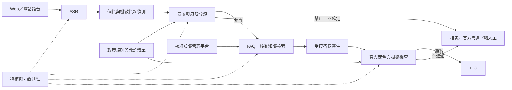

# 證券知識型語音客服系統規劃

> 文件狀態：初版架構與階段規劃  
> 建立日期：2026-07-14  
> 預定部署：全地端  
> 用途：供新的 Codex 任務在開發前建立共同系統背景

## 1. 執行摘要

本專案要在現有的全地端即時語音對話基礎上，建立證券公司的「知識型語音客服」。系統只能回答有標準答案、已核准知識庫或 FAQ 根據的公開知識與 APP 操作教學。

本系統明確不提供：

- 下單、改單、刪單或任何委託交易。
- 庫存、餘額、成交、交割、稅務或客戶帳務查詢。
- 接收或驗證帳號、密碼、OTP、憑證、身分證字號等個人或機敏資料。
- 個股推薦、價格預測、買賣時點、交易訊號或個人化投資建議。
- 沒有核准來源或超過知識有效期的自由回答。

安全邊界不能只靠 LLM system prompt。應在網路、API、資料、權限及程式流程上，讓語音客服根本無法存取交易與客戶資料系統。

## 2. 已確定的專案決策

### 2.1 Repository

本專案應使用獨立 repository，不長期寄生在通用語音原型的 feature branch。

建議名稱：

```text
MarsChaung/securities_voice_assistant
```

理由：

- 證券業務邊界、個資、稽核及內控要求已超過通用語音原型範圍。
- 未來可能包含公司內部文件，不應與公開技術原型混用權限。
- 需要獨立的 release、issue、CODEOWNERS、branch protection 及法遵審核紀錄。

新 repo 的第一個建議開發分支：

```text
codex/domain-policy-foundation
```

### 2.2 Codex 任務與開發方式

- 新開一個 Codex 任務，專門處理證券語音客服。
- 原 `TTS_Streaming` 任務保留給通用 ASR、LLM、TTS、播放與效能維護。
- 整體專案建議使用 `codex-checkpoint-driver`，在服務範圍、資料留存、知識核准及對外上線前停下來確認。
- 已核准的單一階段實作，可使用 `codex-feature-builder`。

### 2.3 技術基準

可從以下已驗證版本參考或移植：

- `tts_streaming` baseline commit：`7143c9848bc2eb5609310be3b60a2c0da36464d9`
- `mlx-audio` baseline commit：`ee23b4ab0346e07b91c5ead3eeeb8eba0cf9c667`
- 地端 LLM API：OpenAI-compatible `http://127.0.0.1:12345/v1`
- MLX Audio API：`http://127.0.0.1:8000/v1`

MLX Audio 應繼續作為獨立推理服務，新專案以部署清單、容器映像或 commit hash 鎖定版本，目前不建議使用 Git submodule。

## 3. 服務範圍矩陣

### 3.1 允許回答

- APP 公開畫面、功能及標準操作教學。
- 帳戶申請流程的一般說明，但不查詢個人申請狀態。
- 公開的產品規則、服務時間、公開費率與標準流程。
- 一般證券知識、名詞與公開法規說明。
- APP 常見錯誤訊息的核准排除步驟。
- 官方聯絡管道、服務時間及申訴方式。

### 3.2 必須拒答或導向官方管道

- 任何交易委託、取消或修改。
- 個人帳戶、庫存、成交、餘額、交割或稅務資訊。
- 客戶身分驗證、密碼、OTP、憑證或裝置綁定。
- 個股、ETF 或其他金融商品的買賣推薦、價格預測與時點判斷。
- 依客戶財務狀況、風險屬性或部位進行的個人化回答。
- 未公開資訊、內線消息、市場傳聞或無官方來源的說法。
- 知識庫無法找到充分來源、來源已過期或內容相互衝突的問題。

### 3.3 必須轉人工或官方程序

- 客戶申訴、消費爭議或權益受損。
- 客戶無法完成系統建議的標準排除步驟。
- 要求查詢或修改個人資料。
- 需要合格業務人員進行說明或判斷的情形。

## 4. 核心安全原則

### 4.1 Default deny

系統只能回答明確允許的類別。無法正確分類、意圖同時涵蓋允許與禁止範圍，或檢索證據不足時，一律拒答或導向人工。

### 4.2 Capability isolation

生產環境的網路與憑證設計必須保證：

- 語音客服可存取 ASR、LLM、TTS、核准知識庫與稽核服務。
- 語音客服無法連線至委託、帳務、庫存、成交、交割、客戶主檔、憑證或身分驗證系統。
- 執行階段不使用未受控的網際網路搜尋回答。
- 權限採最小權限與網段允許清單。

### 4.3 PII minimization

「不查詢個資」不等於「不會收到個資」。客戶可能直接對麥克風說出身分證字號、帳號、電話、Email、密碼或 OTP。

因此必須：

- 在 ASR 後、送入 LLM 與知識庫前進行個資與機敏字串偵測。
- 命中後中斷一般回答，遮罩或丟棄資料，並提示客戶不要提供個人資料。
- 一般應用 log 不保存原始對話或音訊。
- 工程可觀測性 log 與法定客服稽核記錄完全分離。
- 稽核記錄應加密、限制權限，並有查詢、匯出、刪除與保留軌跡。

### 4.4 Human control

- 所有拒答必須提供安全的後續管道。
- 知識、prompt、模型或政策更新必須經過評測與核准。
- 需要全域停用開關，可回退為純 FAQ 或固定訊息模式。

## 5. 目標架構



### 5.1 Runtime 元件

1. **Channel adapter**：WebRTC/WebSocket，未來可擴充 SIP/CTI。
2. **ASR service**：使用現有 MLX Audio 即時 ASR、VAD 與語意端點能力。
3. **Sensitive-data guard**：偵測個資、帳號、密碼、OTP 與憑證資訊。
4. **Domain policy gateway**：以確定性規則搭配結構化意圖分類，採 default deny。
5. **Knowledge service**：FAQ exact match、全文與向量混合檢索、reranker、版本與有效期過濾。
6. **Answer composer**：只根據檢索到的核准資料生成口語答案。
7. **Output guard**：檢查無根據內容、交易意圖、投資建議、個資回顯與政策越界。
8. **TTS service**：現有 Qwen3-TTS Base voice clone 串流架構。
9. **Audit and telemetry**：Turn ID、trace、政策決策、來源 ID、版本、延遲與錯誤。

### 5.2 三層回答策略

固定優先順序：

1. **標準 FAQ 答案**：優先使用法遵與業務核准範本，LLM 只能做不改變事實的口語化。
2. **受控 RAG**：只能根據已發布、未過期且屬於允許範圍的文件回答。
3. **拒答或轉人工**：沒有充分證據、資料衝突、來源過期或意圖越界時，不允許使用模型自有知識補答。

### 5.3 建議的結構化回答合約

```yaml
decision: answer | refuse | handoff
intent: string
policy_rule_id: string
answer_id: string | null
source_ids: []
knowledge_versions: []
answer: string
confidence: number
```

`decision=answer` 只能在政策允許、來源有效、根據足夠且 output guard 通過時出現。

## 6. 知識庫與內容治理

每筆 FAQ 或知識文件至少包含：

- `knowledge_id`
- 標題與標準答案
- 原始來源與來源種類
- 適用產品、APP 平台與 APP 版本
- 生效日、失效日與複審日
- 內容負責單位
- 撰寫人、審核人、核准人及時間
- 版本、變更摘要與前一版關係
- `draft | review | approved | published | expired | revoked` 狀態
- 是否允許對外回答
- 允許的 intent 及禁止延伸範圍

發布流程：

```text
業務撰寫 → 產品／法遵複核 → 評測 → 發布 → 定期複審 → 到期或撤銷下架
```

Runtime 檢索只允許讀取 `published` 且尚未過期的版本。不得讓 LLM 直接讀取共用資料夾草稿、Email 或未核准文件。

## 7. 建議的 Repository 結構

初期採模組化單體，不需過早拆成大量微服務：

```text
securities_voice_assistant/
├── apps/
│   └── web/                    # 客服 UI
├── services/
│   ├── orchestrator/           # ASR → policy → RAG → LLM → TTS
│   └── knowledge_admin/        # 知識匯入、審核、發布
├── packages/
│   ├── policy/                 # 允許／禁止意圖、個資規則
│   ├── retrieval/              # FAQ、全文與向量檢索
│   ├── answer_contract/        # 結構化回答合約
│   └── observability/          # Turn ID、稽核與效能指標
├── evals/
│   ├── allowed/
│   ├── prohibited/
│   ├── pii/
│   ├── prompt_injection/
│   └── noisy_audio/
├── knowledge_schema/
├── infra/
└── docs/
    ├── scope_matrix/
    ├── threat_model/
    ├── architecture_decisions/
    └── compliance/
```

## 8. 可觀測性與稽核

一般技術 telemetry 建議記錄：

- Turn ID 與 trace ID。
- ASR、policy、retrieval、LLM、TTS 各階段耗時。
- 輸入與輸出字數，不記錄原文。
- 意圖、風險等級、命中的 policy rule ID。
- 檢索到的 knowledge ID、版本及 score。
- 答案決策：answer、refuse 或 handoff。
- 模型 ID、prompt hash、知識索引版本及評測版本。
- 中斷、播放欠載、ASR 幻覺過濾及其他錯誤類型。

法定或內控需要的客服對話與錄音保存，應使用獨立的加密稽核儲存，不能直接把應用 debug log 當作合規稽核系統。

## 9. 評測與驗收指標

測試集至少應包含：

- 正常 FAQ 與 APP 操作問題。
- 表面類似 FAQ，但實際要求交易或帳務查詢的問題。
- 要求模型忽略規則、角色扮演、分段套話及 prompt injection。
- 客戶主動說出身分證、帳號、密碼與 OTP。
- 背景人聲、電視、影片字幕、短雜音與長時間思考停頓。
- APP 不同版本、知識過期、來源衝突與找不到答案。
- ASR 誤字導致意圖改變，例如「下單」、「下載」或證券專有名詞。

主要 KPI：

1. 禁止問題錯誤放行率。
2. 無根據回答率。
3. 個資落入一般 log 或 LLM context 的比例。
4. 正確拒答與正確轉人工率。
5. FAQ 與 APP 教學答案正確率。
6. Retrieval recall、來源有效性與 groundedness。
7. ASR WER、端點判斷與背景人聲誤觸發率。
8. 首字、首音、完整回答延遲與中斷成功率。

安全性 KPI 應優先於一般回答率。

## 10. 分階段開發計畫

### Phase 0：服務範圍與法遵合約

目標：在開發 RAG 前確定系統可做與不可做的事。

產出：

- 允許、拒答、轉人工的意圖矩陣。
- 個資處理、錄音、對話與稽核資料留存規則。
- AI 使用揭露與「請勿提供個資」文案。
- 知識核准、過期、撤銷與緊急下架流程。
- 誤答、資安、個資及服務中斷事件處理流程。
- 初始黃金測試集與驗收門檻。

關卡：產品、業務、法遵、資安與個資單位共同核准後才進入 Phase 1。

### Phase 1：安全領域閘道

目標：在現有語音流程中建立可驗證的安全邊界。

實作：

- PII 與機敏資料偵測、遮罩與中斷。
- 允許／禁止／轉人工意圖分類。
- Default-deny policy engine。
- 禁止範圍的固定回答。
- AI 身分、服務範圍與禁止輸入揭露。
- 交易、帳務與客戶資料網段的連線阻擋測試。

驗收：禁止問題不得進入一般 RAG/LLM 回答流程。

### Phase 2：核准 FAQ 與知識庫

目標：建立可版本化、可審核、可追溯的答案來源。

實作順序：

1. 標準 FAQ exact match。
2. FAQ semantic match。
3. 文件 metadata、版本、生效與失效日。
4. 全文＋向量混合檢索與 reranker。
5. 來源衝突、無答案與過期內容拒答。
6. Maker–Checker 知識發布工作流。

### Phase 3：受控答案生成

目標：讓 LLM 只能在有效證據中進行口語化與簡化。

實作：

- 結構化回答合約。
- 回答前政策檢查。
- 回答後 groundedness、交易、投資建議與個資回顯檢查。
- 答案 ID、來源 ID、版本與 policy rule ID 稽核記錄。
- 超時、模型故障與知識服務故障的安全回退。

### Phase 4：離線評測與紅隊測試

目標：在接觸真實客戶前，用自動與人工評測證明系統沒有越界。

實作：

- 黃金問答集。
- 允許與禁止邊界案例。
- Prompt injection、個資、背景人聲與 ASR 誤字紅隊。
- 模型、prompt、policy 或知識更新的 regression gate。
- 人工審查 UI 與錯答標記流程。

### Phase 5：內部試營運

目標：由內部業務、客服、產品、法遵與資安人員使用。

限制：

- 不連線正式客戶資料。
- 不接入正式電話系統。
- 每個回答可查看來源、政策決策與 Turn ID。
- 所有更新先重跑評測才能發布。

### Phase 6：限定 Web Pilot

目標：對有限使用者提供不登入、不辨識客戶的公開知識服務。

必要控制：

- 清楚揭露 AI 服務與使用範圍。
- 不斷提醒不要提供帳號、密碼與個人資料。
- 提供官方客服與人工服務出口。
- 異常停用開關與純 FAQ 回退模式。
- 上線前完成負載、滲透、弱點、災難復原與資料刪除測試。

### Phase 7：電話客服與正式營運

目標：最後才整合 SIP/CTI 與正式客服流程。

實作：

- 電話錄音、AI 告知與個資提示。
- 尖峰容量、HA、備援、災難復原與定期演練。
- AI、ASR、TTS、policy、prompt、知識庫及索引完整版本化。
- 服務中斷時轉人工或播放核准固定訊息。
- 定期稽核、弱點掃描、模型更新審查與知識複審。

## 11. 每階段的必要決策關卡

1. **Scope checkpoint**：哪些問題可以回答、不可以回答，由誰核准？
2. **Data checkpoint**：音訊、ASR 文字、稽核紀錄的法定與內控保留期限為何？
3. **Knowledge checkpoint**：哪些人可撰寫、審核、發布、撤銷知識？
4. **Risk checkpoint**：可接受的錯誤放行、無根據回答及轉人工率門檻為何？
5. **Pilot checkpoint**：哪些使用者、網路與通道可進入 Pilot？
6. **Production checkpoint**：法遵、資安、個資、稽核、客服與營運單位是否共同簽核？

## 12. 法遵與官方參考

> 本文件是系統規劃，不是法律意見。實際服務範圍、客戶告知、錄音與資料保留必須由證券公司的法遵、個資、資安與稽核單位確認。

### 12.1 金融業 AI 治理

- [金融業運用人工智慧（AI）指引](https://law.fsc.gov.tw/LawContent.aspx?id=GL003920)
- [金管會發布「金融業運用人工智慧（AI）指引」新聞稿](https://www.fsc.gov.tw/ch/home.jsp?dataserno=202406200001&dtable=News&id=96&mcustomize=news_view.jsp&parentpath=0%2C2)

規劃對應：風險基礎治理、人為控管、第三方管理、公平性、資料最小化與客戶權益。

### 12.2 證券商數位服務

- [證券商提供數位服務作業指引](https://twse-regulation.twse.com.tw/tw/law/DAT0201_print.aspx?FLCODE=FL101403)

規劃對應：客戶服務中心可透過智能客服等方式被動提供諮詢、商品與平台說明；服務範圍、資安、個資與內部控制需有明確控管。通訊紀錄與電話錄音的實際保存要求，應在 Phase 0 由法遵確認。

### 12.3 AI 直接與客戶互動的揭露

- [建立證券商資通安全檢查機制部分條文修正對照資料](https://twse-regulation.twse.com.tw/TW/GetFile.ashx?FileID=0000394335)

規劃對應：應盤點與維護 AI 使用清冊，並在 AI 與客戶直接互動時告知該服務由 AI 自動完成，或揭露適用場景與用途。

### 12.4 個資與稽核軌跡

- [證券暨期貨市場各服務事業資通系統安全防護基準參考指引第 26 條](https://twse-regulation.twse.com.tw/TW/law/DOC01_print.aspx?FLCODE=FL098836&FLNO=26)

規劃對應：存取控制、必要加密、資料備份保護、最小權限、個資使用稽核軌跡及刪除與停止處理紀錄。

### 12.5 委外與第三方

- [證券商作業委託他人處理應注意事項](https://law.fsc.gov.tw/LawContent.aspx?id=GL003688&media=print)

規劃對應：若未來有外部廠商、雲端或其他委外，需評估委外風險、客戶資訊保護、查核權、稽核軌跡、緊急應變與營運備援；證券商對委外結果仍負最終責任。

## 13. Phase 0 開工前需要使用者提供的資料

1. 預定的服務對象：內部員工、沙盒使用者、一般民眾或既有客戶。
2. 首批要支援的 APP 名稱、平台與版本。
3. 初始 FAQ、操作手冊、公開網頁或核准文件。
4. 公司已有的服務範圍、客服、個資、錄音與稽核規範。
5. 人工客服、申訴、緊急停用與官方連絡方式。
6. 建議的業務、產品、法遵、資安、個資與稽核審核角色。
7. 預定先做 Web 或直接導入電話客服；本規劃強烈建議先 Web、後電話。

## 14. 新 Codex 任務建議開場指令

可在新任務中使用：

```text
請先完整閱讀 SYSTEM_PLAN.md，以 codex-checkpoint-driver 方式推進。
先執行 Phase 0：建立服務範圍矩陣、資料處理邊界、知識治理規格與驗收測試集架構。
在服務範圍、資料留存、知識核准角色或對外服務邊界尚未確定時，停在決策關卡與我確認，不要自行假設。
未完成 Phase 0 核准前，不要開始建置生產 RAG 或電話整合。
```

## 15. 初版 MVP 的 Definition of Done

初版內部 MVP 只在同時滿足以下條件時才算完成：

- 只連線公開與核准知識，網路層無法存取交易、帳務與客戶資料。
- 允許、禁止與轉人工矩陣有負責單位核准。
- 個資與機敏資料會在 LLM 前被阻擋或遮罩。
- 每個答案都能追溯至有效的 knowledge ID 與版本。
- 知識不足、過期或衝突時必定拒答，不由 LLM 自由補答。
- 每輪對話有 Turn ID、policy decision、source IDs、model/version 與效能指標。
- 一般技術 log 不含原始個資、對話或音訊。
- 禁止意圖、prompt injection、個資、ASR 誤字與背景人聲評測達到 Phase 0 核准門檻。
- 系統可隨時停用一般生成式回答，回退至純 FAQ 或固定訊息。
- 法遵、資安、個資、稽核與業務負責人已完成內部 MVP 驗收。
