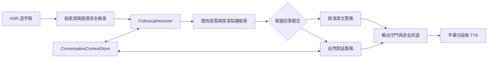

# 自然對話語音客服模式開發計劃

- 狀態：第一階段已完成混合式追問解析、雙路檢索與核准段落選擇
- 日期：2026-08-11
- 適用範圍：`/voice-test` 本機語音客服測試

## 1. 目標

在不改變既有「核准原文模式」行為、且第一版不擴充知識項目結構的前提下，新增「自然對話模式」。自然對話模式仍只使用知識治理中心中已發布且允許回答的知識，但可以：

1. 將核准標準答案改寫成較自然、適合語音播放的客服用語。
2. 參考同一通電話最近數輪對話，理解「剛才那一段」、「費用呢」、「換個方式說」等追問。
3. 針對使用者指定的部分重新組織或加強說明，而不是直接重複上一輪完整回答。
4. 當追問超出目前核准標準答案時，明確表示現有核准資料不足，不使用模型自身知識補答。
5. 模型、解析或輸出守門失敗時，安全回退到相同知識項目的核准原文。

## 2. 非目標

第一版不包含：

- 擴充 `KnowledgeItem` 的資料欄位或資料庫 migration。
- 自動抓取來源網頁作為未經治理的補充內容。
- 保存原始音訊或建立長期客戶對話紀錄。
- 跨通電話延續上下文。
- 交易、帳務、投資建議或其他既有政策邊界的放寬。
- 讓前端直接選擇 `shadow_llm`、`controlled_llm` 或緊急安全模式。

## 3. 使用者體驗

在「參數設定」新增「客服回答模式」：

- `核准原文`：預設值，完整沿用目前回答流程。
- `自然對話`：使用受控自然回答與最近數輪上下文。

模式在打電話前選擇，通話開始後鎖定，掛電話後才可重新選擇。若後端未啟用自然對話模型，前端只顯示或允許選擇核准原文。

自然對話範例：

1. 客戶：「如何修改個人基本資料？」
2. AI：依核准知識，以口語方式說明可辦理的公開流程。
3. 客戶：「剛才臨櫃那一段可以說詳細一點嗎？」
4. AI：沿用同一筆核准知識，只聚焦重新說明臨櫃相關內容。
5. 客戶：「那可以請你直接幫我修改嗎？」
6. AI：仍由既有政策阻擋或轉人工，自然模式不得覆寫安全決策。

## 4. 架構原則

共用既有 ASR、插話、靜默逾時、結束語、個資偵測、政策分類、核准知識檢索、引用、字幕與 TTS。只在「上下文解析」及「回答組合」加入可替換模組，不複製語音頁面或串流流程。



### 4.1 回答模式與部署模式分離

新增面向通話體驗的回答模式，例如 `exact` 與 `natural`。現有 `AnswerMode` 的 `shadow_llm`、`controlled_llm`、`fixed_message` 保留為後端部署與安全控制，不直接暴露成前端選項。

### 4.2 ConversationContextStore

第一版使用程序內記憶體儲存，依 `conversation_id` 隔離，並具備：

- 最近固定上限的對話輪次。
- 每輪的客戶逐字稿、解析後查詢、AI 回答、決策與知識 ID／版本。
- 閒置逾時清除與最大 session 數限制。
- 掛電話、結束語或第二次靜默逾時後主動清除。
- 不寫入一般稽核 log，不保存音訊，不跨程序或跨重啟保存。
- `/voice-test` 的文字與語音測試共用畫面上的 session ID；development 可明確開啟
  專用診斷 log，記錄非敏感問答以利依 session ID 定位問題。個資輪次一律遮蔽，
  正式環境不生效。

若未來改為多 worker 或多節點部署，再以相同介面替換為具 TTL 的共享儲存；第一版不提前加入 Redis。

### 4.3 FollowUpResolver

FollowUpResolver 讀取最近數輪對話，產生受限的解析結果：

- `new_question`：新主題，正常使用當輪問題檢索。
- `elaborate`：針對上一輪某部分深入說明。
- `rephrase`：沒聽清楚或要求換句話說。

解析結果包含本輪檢索用查詢與可提供給自然回答器的對話片段。明確追問先採可測試的
確定性規則；規則判定為新問題但 session 內仍有成功知識回答時，由結構化 LLM resolver
判斷追問類型、參考輪次、焦點及完整檢索問句。resolver 提供 `disabled`、`shadow`、
`controlled` 三種模式，低信心、模型錯誤、個資輸入或無效參考輪次一律回退規則結果。
檢索同時評估原始問句與上下文改寫問句；最近知識只有在改寫問句對該知識仍達既有門檻
時才取得受限加權。

當問句同時包含「沒聽清楚」與明確焦點（例如時間、費用或到場要求）時，應視為局部
追問，不得只因重述用語而重播完整答案。明確焦點可由規則先選段；其餘情況由自然回答
模型在同一次結構化回應中回傳使用到的核准段落編號。程式只接受存在的段落，生成失敗
或輸出守門拒絕時，也只回退已選定的核准段落。時間守門可接受 `16:30` 與
「下午4點30分」等語意相同的格式，但仍拒絕核准內容未出現的時段。

無論解析結果為何，當輪原始逐字稿仍必須先經過個資與硬性政策規則。上下文只能協助允許範圍內的意圖與檢索，不能覆寫拒答或轉人工。

### 4.4 自然回答器

自然回答器只接收：

- 本輪原始問題與 FollowUpResolver 類型。
- 最近數輪有限對話。
- 本輪命中的單筆已發布知識之 `standard_answer`。
- 知識 ID、版本、來源 ID 與 `prohibited_extensions`。

模型使用結構化 JSON 輸出、低溫度及版本化提示詞。提示詞要求：

- 事實只能來自本輪 `standard_answer`。
- 歷史對話只用於判斷指涉、回答焦點與避免重複，不是新的事實來源。
- 保留限制、例外、警語與官方資訊優先語意。
- 追問超出核准內容時，直接說明資料不足。
- 不提供交易執行、個人帳務、投資建議或模型自身知識。

輸出沿用既有 `ControlledOutputGuard`。生成錯誤、逾時、格式錯誤或守門失敗時，回退核准原文。

為降低語音等待時間，新問題不把前一主題的完整對話送入回答模型；首次回答原則上控制在
3 句或 160 個中文字內，先回答核心，再由後續追問展開細節。精簡時仍不得省略會改變答案
適用性的資格、限制、例外或警語。局部追問與換句話說仍保留必要的同一 session 歷史。

## 5. API 契約

`POST /v1/voice/respond-stream` 向後相容地增加：

```json
{
  "transcript": "剛才費用那一段再說一次",
  "conversation_id": "UUID",
  "reply_mode": "natural"
}
```

- 未提供 `reply_mode` 時預設為 `exact`，既有呼叫維持不變。
- `natural` 必須提供合法 `conversation_id`。
- 模式只能從後端公開設定允許的 enum 中選擇。
- 新增通話結束清除端點，前端掛電話時以 best-effort 呼叫。
- `/v1/voice/config` 回傳目前可用的客服回答模式；不揭露模型密鑰或提示內容。

## 6. 開發切片與驗證

### Slice 1：契約與上下文基礎

- 新增回答模式 enum、對話 exchange、ContextStore 及 FollowUpResolver。
- 測試 session 隔離、輪次上限、TTL、清除、新問題與常見追問分類。
- 驗證：既有 `VoiceReplyRequest` 只傳 transcript 仍可通過。

### Slice 2：受控自然回答

- 新增自然回答 composer 與版本化結構化提示詞。
- 將最近數輪對話與本輪核准 evidence 接入生成流程。
- 沿用輸出守門；錯誤或不安全輸出回退原文。
- 驗證：自然回答保留 knowledge ID、版本與 citations；禁止新增數字、產品或高風險內容。

### Slice 3：語音 API 與通話生命週期

- 整合 `conversation_id`、FollowUpResolver 與 ContextStore。
- 結束語、手動掛電話與靜默結束清除 session。
- 驗證：同一通電話可針對前輪追問，不同 conversation 不互相污染。

### Slice 4：voice-test UI

- 在參數設定加入客服回答模式。
- 通話期間鎖定選項，掛電話後恢復。
- 每通電話建立新的 UUID 並隨自然模式請求送出。
- 驗證：原文模式請求與畫面行為不變；自然模式才帶入上下文欄位。

### Slice 5：回歸與評測

- 單元測試：store、resolver、composer、output guard。
- API 測試：預設相容、自然模式、清除、模型失敗回退。
- 語音測試：結束語、插話、靜默逾時與字幕播放不回歸。
- 評測案例：換句話說、局部追問、新主題、政策拒答、知識不足、提示注入及 session 隔離。
- 執行 Ruff、mypy、Node 語音測試與完整 pytest。

## 7. 啟用與回退

自然模式以後端設定旗標啟用，且必須設定可用的本機回答模型。預設仍為核准原文。若模型不可用、生成逾時、解析不可靠或輸出守門失敗，單輪回退核准原文；若需緊急停用，可只關閉自然模式，不影響原有語音客服。

## 8. 第一版驗收條件

1. 未選自然模式時，既有回覆、安全決策與語音流程測試全部通過。
2. 自然模式只使用已發布知識，回答仍帶原知識 ID、版本與引用。
3. 同一通電話可理解至少最近四輪內常見的局部追問與換句話說要求。
4. 不同 conversation 的內容不互相出現，掛電話或逾時後上下文會清除。
5. 硬性拒答、轉人工、個資防護及結束語優先於自然回答。
6. 任何生成或守門錯誤都回退核准原文，不讓未核准內容進入 TTS。

## 9. 已知限制與後續方向

- 只靠單段 `standard_answer` 時，「深入說明」仍受原文資訊量限制。
- 混合式 FollowUpResolver 仍可能對模糊指涉回退為新問題；需持續用去識別案例校準信心門檻。
- 程序內 ContextStore 不適用多 worker／多節點；正式部署前需替換共享 TTL store。
- 自然回答比原文模式增加一次模型推論延遲，需另外量測首字延遲與完整 TTS 延遲。
- `turn_decision` 稽核事件會分別記錄對話解析、語意模型、政策守門、檢索、意圖路由、
  回答生成、服務本體及端到端延遲，供後續依 session／turn ID 比對效能。
- 若未來要提供真正更完整的細節，仍應透過知識治理新增經核准的詳細說明或段落，而不是放寬模型使用自身知識。
